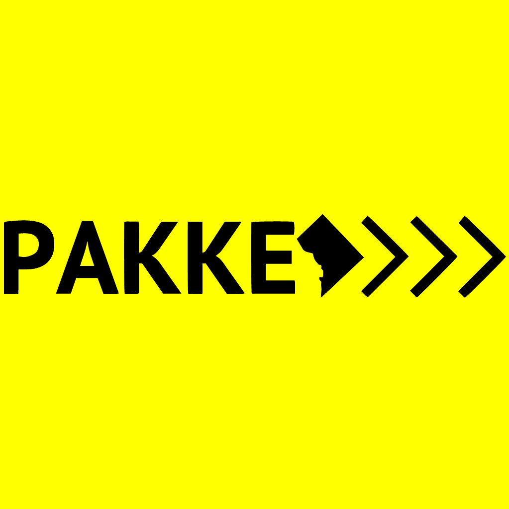

# PAKKE
> "Discover. Connect. Experience."

Pakke is a platform that connects guests, hosts, and talent. This platform brings people together to share unique and interesting experiences. 

For guests, we enable people to find unique events around the city and connect with new and interesting people. 

For hosts, we enable people to use their space to hold events.

For talent, we enable people to share their unique talents with the world. 

## Installing / Getting started

This is a [meteorJS](http://docs.meteor.com) application. To get started with this application, one must:

1. [Install meteor](https://www.meteor.com/install)
2. clone this repo
3. create a new branch; and go wild!


## Developing

### Built With
MeteorJS:

[react-meteor-data](https://github.com/meteor/react-packages/)
[dburles:google-maps](https://github.com/dburles/meteor-google-maps)
[fortawesome:fontawesome](https://github.com/MeteorPackaging/Font-Awesome/)
[server-render](https://atmospherejs.com/meteor/server-render)
[themeteorchef:bert](https://github.com/themeteorchef/bert)
[alanning:roles](https://github.com/alanning/meteor-roles)
[twbs:bootstrap](https://github.com/twbs/bootstrap)

[accounts-base]
[accounts-ui]
[accounts-password]
[accounts-facebook]
[accounts-google@1.3.1]
[facebook-config-ui@1.0.1]
[google-config-ui@1.0.0]
[gadicc:blaze-react-component]
[aldeed:collection2-core@2.0.0]

### Prerequisites
All prerequisites are listed in package.json and will build with `npm install`

### Setting up Dev

Here's a brief intro about what a developer must do in order to start developing
the project further:

```shell
git clone https://bitbucket.org/KHB/pakke.git
cd pakke/
npm install
```
Then connect to `http://localhost:3000` and you're up and running.


### Building

...

### Deploying / Publishing

...

## Versioning

...

## Configuration

...

## Tests

...

## Style guide

using AirBnB

## Api Reference

Utilizing Google Maps API, 


## Database

MongoDB, 
utilizing [mLab](mlab.com) for live database, tied to "kiel@pakke.us"


